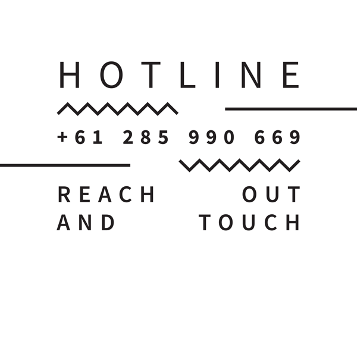

# HOTLINE, 2015-

Dear _____, 

I have been working on a new old fashioned 80's or 90's HOTLINE for _______. At the moment it's a really simple system that allows anyone to either leave a message or listen to the previously recorded messages (these are randomly spliced into a seamless loop).

Would you be interested in contributing something? I am not wanting to dictate what, basically because as I trust your thoughtfulness. I am asking a number of people who I respect, and hope that collectively something may come into being that could be interesting. What say you?

A few pragmatic things to note: 

- call this number ( 02 85 990 669 ) and follow the prompts.
- The recordings a limited to 2 minutes in length. ( This is a software limitation because I am auto transcribing all the messages. The transcripts may be presented as a torrent of flowing info on the website, but I am not sure yet. Leaving options open. )
- Silence at the start and end of messages is automatically clipped.
- There is no limit on how many recordings you can make - but they may not be played back consecutively.
- if you hang up without saving the message, it will be automatically discarded.
- Due to the open form, there is no way of crediting contributors, but if you can include it within the recording if you desire.

I think that’s it. But just to re-iterate - it would be great to have you involved.

<3
Benjamin